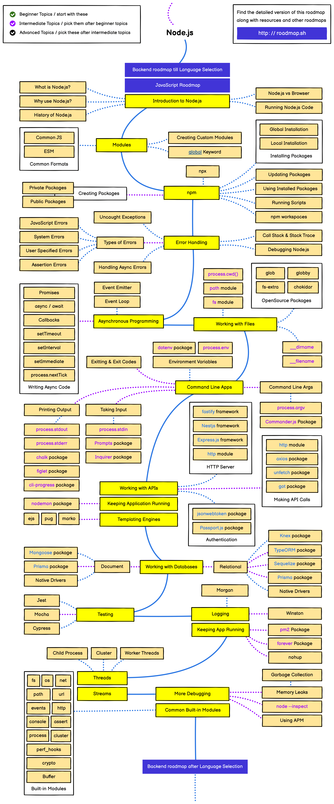

# NODE.JS
## Table of Contents

- [Module 1 - Intro](l.nodejs.intro.md)
- [Module 2 - File System Module](l.nodejs.file-system-module.md)
- [Module 3 - Path Module](l.nodejs.path-module.md)
- [Module 4 - Os Module](l.nodejs.os-module.md)
- [Module 5 - Url QueryString](l.nodejs.url-querystring.md)
- [Module 6 - Http Module](l.nodejs.http-module.md)

[Documentation](https://nodejs.org/en/docs/guides)

[Status Code](https://developer.mozilla.org/en-US/docs/Web/HTTP/Status)

